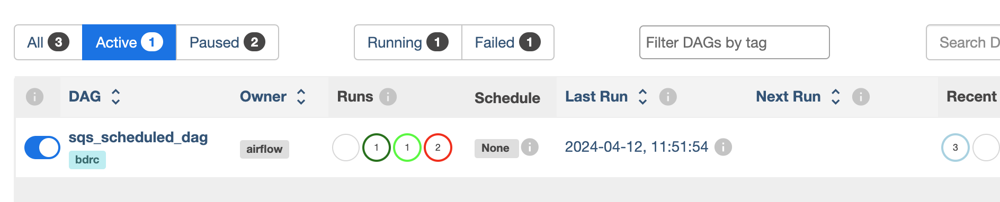

========================
BDRC Airflow Development
========================

This document contains details of the different elements of ``airflow-docker`` and how their elements relate.

Architecture of this module
===========================

the principal components of this module are:


- the DAG code that runs the operations.

- facilities for marshalling code blocks.

- test utilities.

Development and Test Before Docker
==================================

Before launching into moving the DAGS into a Docker environment, you can test your airflow DAGS and the system in two other modes:
- debugging (in an IDE)
- on a local web server, to test parallelism and scheduling.

Debugging and initial test
--------------------------

- create a development environment with ``pyenv`` or ``conda`` that includes the apache and the BDRC libraries. (see ``requirements.txt``)
- In your DAG code, inclue a ``__main__`` block that runs ``your_dag.test()``  (See dags/FileWatcherDebagSync.py for an example) You can run this under your IDE's debugger (You have to watch for PATH, because the shell that syncs is imperfect.)
- There's a helpful environment variable that bank switches all the parameters to development values

.. code-block:: python

    if os.getenv("PYDEV_DEBUG") == "YES":
        DAG_TIME_DELTA = _DEV_TIME_SCHEDULE
        ...

 If you're in an IDE, you can set this environment, most usually in the Run/Debug configuration.
Local airflow services test
---------------------------

The IDE environment above doesn't test some parallelism that you might need (e.g. can several instances of the same DAG run in parallel). To do this, you would need to run airflow locally. Happily, this is easy. ``airflow-docker/``local-airflow.sh`` provides shorthands for:

    - re-initializing the airflow database (good for cleaning out old records)
    - starting and stopping the airflow webserver and scheduler (these are necessarily separate services, but are all you'll need to test locally
    - creating the admin user you'll need.

``local-airflow.sh`` is largely self-documenting and easy to read. The bare minimum to get up and running the first time (or to clear out a clutter of old test runs) is:

.. code-block:: bash

    ./local-airflow.sh -r
    ./local-airflow.sh -a admin admin some@email.address
    ./local-airflow.sh -w -u
    ./local-airflow.sh -s -u

and to stop:

.. code-block:: bash

    ./local-airflow.sh -w -d
    ./local-airflow.sh -s -d

Eager beaver improvers are welcome to coalesce the stop actions into one command.

After starting the services, airflow will look in ``~/airflow/dags`` for DAGs to run. You can copy your DAGs there, and they will be available in the UI. I make and test changes in my IDE, under source control, and copy what I need into ``~/airflow/dags`` as needed.


Building the Docker image -- ``bdrc-docker.sh``
==================

.. note::

    ``bdrc-compose-dockerfile.yml`` has a dual role in this process. It not only is a standard dockerfile for :strong:`running` the image, but it is also used to :strong:`build` it. Building inside the dockerfile frees you from having to worry about changing directories to access the material, and keeps the build process out of the development repo.

.. important::

        ``$COMPOSE_BUILD_DIR`` is only used to create the docker image. It has no further part in the process.

``bdrc-docker.sh`` is the entry point to building the :strong:`bdrc-airflow` image, that ``docker compose`` runs later. It:

#. Sets up a ``COMPOSE_BUILD_DIR``
#. if -rebuild, wipes out the ``COMPOSE_BUILD_DIR`` otherwise adds to it.
#. Copies in (to ``COMPOSE_BUILD_DIR``) the `archive-ops/scripts/syncAnywhere/deployment`  scripts (``syncOneWork.sh``) to a place where they can be added to the docker image
#. Merges two sets of requirement files, and invokes  ``RUN pip install -r requirements.txt`` on the image. This installs all the python libraries that both the DAG and the sync scripts require
#. Brings down the Debian audit tool install image from github and installs it in the image
#. Adds the audit tool configuration to image.
#. Exports environment variables for the `docker compose build` step. These are referenced in the `bdrc-docker-compose.yml` file:


.. tip::

    Really important to be careful about ``.config``. We could possibly bind mount ``~service/.config`` to the container (since the container runs under the host's ``service`` uid: (see ``scheduler:....user:`` clause in `bdrc-docker-compose.yml``) but that brings in the whole tree, and is fragile. So I decided that copying the material from .config should be a manual operation that is selective. As the range of operations in airflow-docker expands, images may need to be built that need more entries from ``.config`` e.g, Google books.
    For now, just copy ``bdrc/auditTool`` into a config dir, and give that dir as the --config_dir argument. After the build is complete, it can be deleted, but should be preserved for next builds.

In ``bdrc-docker.sh``

.. code-block:: bash

    # in the bdrc-docker.sh:
    export DAG_REQUIREMENTS_DEFAULT="./StagingGlacierProcess-requirements.txt"
    export COMPOSE_AIRFLOW_IMAGE=bdrc-airflow
    export COMPOSE_BDRC_DOCKER=bdrc-docker-compose.yml
    export COMPOSE_BDRC_DOCKERFILE=Dockerfile-bdrc
    export BIN=bin
    export AUDIT_HOME=
    export BUILD_CONFIG_ROOT=.config

These are read by ``bdrc-docker-compose.yml`` to build the image:

.. code-block:: yaml

    #--------------------------------------------
    # Referenced in the bdrc-docker-compose.yml, referenced:
      any-name:
    build:
      context: ${COMPOSE_BUILD_DIR}
      dockerfile: ${COMPOSE_BDRC_AIRFLOW_DOCKERFILE:-Dockerfile-bdrc}
      args:
        SYNC_SCRIPTS_HOME: ${BIN}
        PY_REQS: ${COMPOSE_PY_REQS}
        CONFIG_ROOT: ${BUILD_CONFIG_ROOT}


Note especially the ``args:`` clause above. these are exported into Dockerfile-bdrc to build the image. Here are some examples of how Dockerfile-bdrc uses these:

.. code-block:: Dockerfile

    ARG SYNC_SCRIPTS_HOME
    ARG PY_REQS
    ARG CONFIG_ROOT- ``bdrc-docker-compose.yml``
    .....
    ADD $SYNC_SCRIPTS_HOME bin
    ADD $PY_REQS .


Building the runtime ``deploy.sh``
======================

The other purpose of ``bdrc-docker-compose.yml`` is to guide the run-time execution of the ``bdrc-airflow`` image. The script ``deploy`` sets this up. It:

#. Creates a runtime directory (the ``--dest`` argument)

..hint::

    Avoid making ``--dest`` the same place as ``COMPOSE_BUILD_DIR`` in the previous step. This overlays things you don't want to overlay

#. Copies the ``bdrc-docker-compose.yml`` file to the compose build directory/``docker-compose.yaml`` (for normalization).
#. Creates useful folders in the ``--dest`` directory:

- ``logs`` for the logs
    - ``dags`` for the DAGs
    - ``plugins`` for the plugins (none used)
    - ``processing`` for the logs
    - ``data`` for working data (most usually, downloaded archives)

#. Populates ``secrets`` - See :ref:`docker-concepts`
#. Populates the ``.env`` file, the default, **and only** external source for the environment available to the ``docker compose`` command.  ``.env`` is the source for resolving variables in the docker-compose.yaml file.

``.env`` fragment:

.. code-block:: bash

    COMPOSE_PY_REQS=
    BIN=
    # ARCH_ROOT sands for "Archive root" Use ``.`` locally, ``/mnt`` in production
    # When using ``.`` , you need to create all the trees that the "scheduler" section (below) references.
    ARCH_ROOT=/mnt
    ... # other variables
    # The uid of the user that will run the container
    # This is the uid of the user that will run the
    # container. when running in a test environent, replace this with
    # SYNC_ACCESS_UID=5000
    # This is a conventional user meaning the internal
    # docker user id. To connect with actual BDRC internal
    # resources, use 1001 (service)
    SYNC_ACCESS_UID=1001

references in bdrc-docker-compose.yml:

.. code-block:: yaml

  scheduler:
   ...
    user: ${SYNC_ACCESS_UID}
    ...
      - ${ARCH_ROOT:-.}/AO-staging-Incoming/bag-download:/home/airflow/bdrc/data


.. note::

    The ``- ${ARCH_ROOT:-.}/AO-staging-Incoming`` uses standard bash variable resolution. If ``ARCH_ROOT`` is not set, it uses ``.``. This is a common pattern in the ``.env`` file.

From the ``--dest`` dir, you can then control the docker compose with ``docker compose`` commands.

Configuring Dev/Test and Production Environments
================================================

:config invariant: The item referred to does not havve any differences between dev/test and production.


What you can skip
-----------------
Building the docker image and the container are *config invariant*  Even though ``bdrc-docker.sh`` adds in BDRC code, that variables that determine the dev or production environment are all configured at run time (see ``airflow-docker/dags/glacier_staging_to_sync.py:sync_debagged`` for the implementation).

Patterns
--------
The general pattern in in the code is to specify global and environment variable variants:

.. code-block:: bash

    _DEV_THING="Howdy"
    _PROD_THING="Folks"
    # ...
    THING=${_DEV_THING}
    # THING=${_PROD_THING}

In some cases, ``THING`` is replaced as ``MY_THING``

Things to change
----------------

There are two locations that specify a dev/test or production environment. These are all in ``airflow-docker``:

``deploy.sh``
^^^^^^^^^^^^^

There are comments in the ``deploy.sh`` script that indicate the changes to make. In summary:

.. code-block:: bash

    # prod:
    # Prod userid should be `service` uid on bodhi & sattva
    _PROD_SYNC_ACCESS_UID=1001
    # Standard user under docker
    _DEV_SYNC_ACCESS_UID=5000

    # See bdrc-docker-compose.yml - leaving this unset is handled with the:
    # - ${ARCH_ROOT:-/mnt}:/mnt
    # stanza in volumes: This has the same meaning as in bash variable substitution

    _PROD_ARCH_ROOT=
    _DEV_ARCH_ROOT=.

    #MY_SYNC_ACCESS_UID=${_PROD_SYNC_ACCESS_UID}
    #MY_ARCH_ROOT=${_PROD_ARCH_ROOT}

    MY_SYNC_ACCESS_UID=${_DEV_SYNC_ACCESS_UID}
    MY_ARCH_ROOT=${_DEV_ARCH_ROOT}


``dags/glacier_staging_to_sync.py``
^^^^^^^^^^^^^^^^^^^^^^^^^^^^^^^^^^^
- Change the ``MY_DB`` global to the current value.

.. tip::

    ``deploy.sh`` writes the changed environment variables to the path *compose_build_dir*``/.env``  You can change these values in ``.env`` and simply ``docker compose down && dockef compose up -d`` to update them.

    The ``MY_DB`` global is used in the ``sync_debagged`` function to determine the database to use. To update it, you simply replace the *compose_build_dir*``/dags/glacier_staging_to_sync.py`` file with the new version. You may have to check the auto update settings in the airflow UI to be sure this takes effect.


``bdrc-docker-compose.yml``


What is actually happening
==========================

SQS_scheduled_dag
---------------------

This Dag downloads archives restored from Glacier (by a separate process), debags and syncs them.  This DAG is no longer used, due to the cost of downloading from AWS.

All this work supports essentially four functions, which comprise the process. The process container is an airflow DAG named  ``sqs_scheduled_dag``  It appears in the docker UI (https://sattva:8089) as ``sqs_scheduled_dag``.




The DAG contains four :strong:`tasks`, which operate sequentially: their relationship is defined in the code quite directly, using an advanced airflow concept known as the ``Taskflow API``.

.. code-block:: python

    msgs = get_restored_object_messages()
    downloads = download_from_messages(msgs)
    to_sync = debag_downloads(downloads)
    sync_debagged(to_sync)

In the Airflow UI, their relationship is shown in  the UI:

.. image:: /.images/Task-graph.png
    :width: 100%


The actions of the scripts are mostly straightforward Python, but there are two airflow specific elements worth noting:

Retrying when there is no data
^^^^^^^^^^^^^^^^^^^^^^^^^^^^
The  ``get_restored_object_messages``` task will retry if there are no messages. This is shown in the  task graph above: the task is labeled as 'up-for-retry'  This is given as a parameter to the task's decorator. This is the only task to retry on failure, as it is the only one expected to fail, when there are no object messages to retrieve.

Using a bash shell
^^^^^^^^^^^^

The task ``sync debagged`` uses a bash shell to run the ``syncOneWork.sh`` script. The environment to run that script is configured in the task itself. It is a separate environment from the docker image and the airflow container itself.

``down_scheduled``
------------------

This DAG is essentially the same as ``sqs_scheduled_dag``, except that a user has to manually populate a target directory with either ``.zip`` or ```.bag.zip`` files. It handles the unarchiving and syncing. It has extra code that handles:

- ``.zip`` or ``.bag.zip`` files containing multiple works

.. caution::
    A ``.bag.zip`` that contains a single work retains the checksum manifest in the sync'd work. When there is one work, the ``debag`` task output contains the folder ``WorkRID/WorkRID.bag`` which contains a manifest of the work's checksums from the ``bag`` operation. When there are multiple works in the bag, ``WorkRID/WorkRID.bag`` is not produced.

- The ability to sync to the web. This ability is coded by means of a ``WorkRID/config/config.yml`` file that controls the ``sync`` task.


